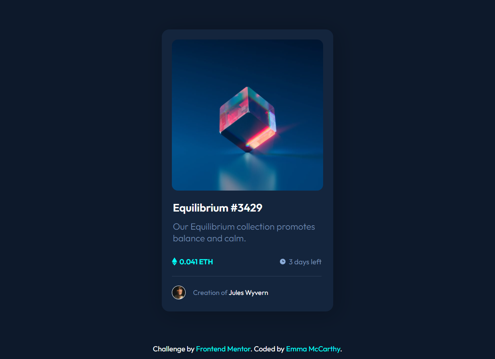

# Frontend Mentor - NFT preview card component solution

This is a solution to the [NFT preview card component challenge on Frontend Mentor](https://www.frontendmentor.io/challenges/nft-preview-card-component-SbdUL_w0U). Frontend Mentor challenges help you improve your coding skills by building realistic projects. 

## Table of contents

- [Overview](#overview)
  - [Screenshot](#screenshot)
- [My process](#my-process)
  - [Built with](#built-with)
  - [What I learned](#what-i-learned)
  - [Continued development](#continued-development)
- [Author](#author)

## Overview

### Screenshot:

### Built with:

- Semantic HTML5 markup
- CSS custom properties
- Flexbox

### What I learned:

I used this project to continue to develop my understanding of layout and flexbox. It definately started to click into place, particularly in relation to nesting elements inside DIVS so that they could be laid out appropriately. 

I found the active states difficult at first but after some googling, I worked out that how to get the color overlay and viewing icons to appear using opacity. This also helped to realise that I could set the background of a DIV using the image, rather than nesting the image as a separate element inside the DIV.

#### What am I most proud of?
- Getting the active states to work.
- Adding animations to the transitions.

### Continued development:

I am still early in my development and flexbox does still confuse me sometimes, so I will continue to seek out projects that challenge me in this area.

## Author

- Frontend Mentor - [@MissEmMcCarthy](https://www.frontendmentor.io/profile/MissEmMcCarthy)
- Twitter - [@MissEmMcCarthy](https://twitter.com/MissEmMcCarthy)
